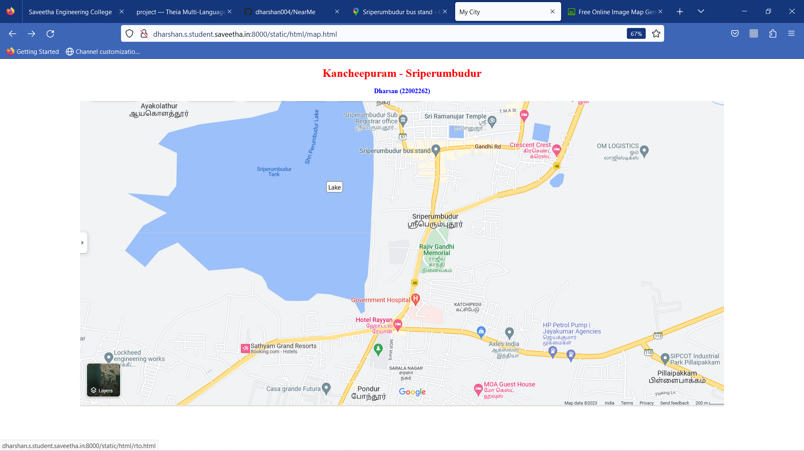
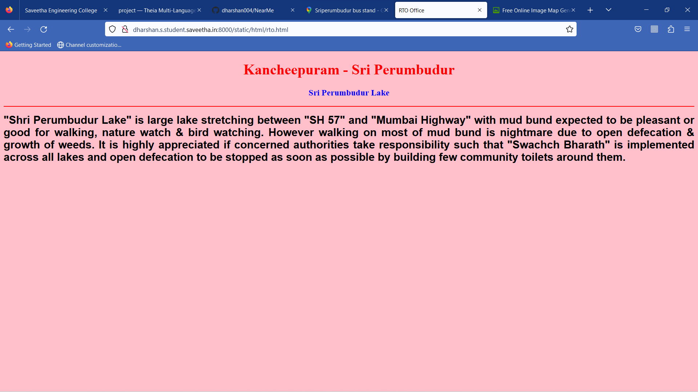
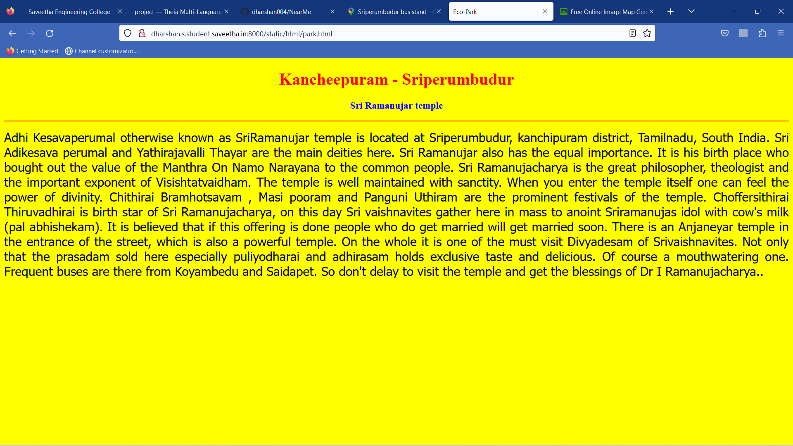

# Places Around Me
## AIM:
To develop a website to display details about the places around my house.

## Design Steps:

### Step 1:
Clone the NearMe repository into the folder named 'EX04'.Perform the necessary changes in settings.py.

### Step 2:
Create a folder named 'static' in which a folder named 'html' has to be created and under which all the required html files are to be included.
Code the main html program for the website and link all the other 5 html codes created regarding the places description.

### step 3:
Edit the readme.md file and push the files to the GitHub to display the contents for the same.

## Program:
```
<!DOCTYPE html>
<html lang="en">
<head>
<title>My City</title>
</head>
<body>
<h1 align="center">
<font color="red"><b>Ariyalur - Cement City</b></font>
</h1>
<h3 align="center">
<font color="blue"><b>Dharsan (22002262)</b></font>
</h3>
<center>

<map name="MyCity">

<map name="image-maps-2023-01-27-154404" id="ImageMapsCom-image-maps-2023-01-27-154404">
<area  alt="" title="ghs" href="ghs.html" shape="rect" coords="336,171,538,244" style="outline:none;" target="_self"     />
<area  alt="" title="rto" href="rto.html" shape="rect" coords="579,158,781,231" style="outline:none;" target="_self"     />
<area  alt="" title="bus" href="bus.html" shape="rect" coords="805,333,973,414" style="outline:none;" target="_self"     />
<area  alt="" title="park" href="park.html" shape="rect" coords="1001,476,1169,557" style="outline:none;" target="_self"     />
<area  alt="" title="vk" href="vk.html" shape="rect" coords="722,505,938,627" style="outline:none;" target="_self"     />
<area shape="rect" coords="1667,629,1669,631" alt="Image Map" style="outline:none;" title="Image Map" href="https://www.image-maps.com/" />
</map>
</center>
</body>
</html>
```

## Output:









## Result:
Write your result